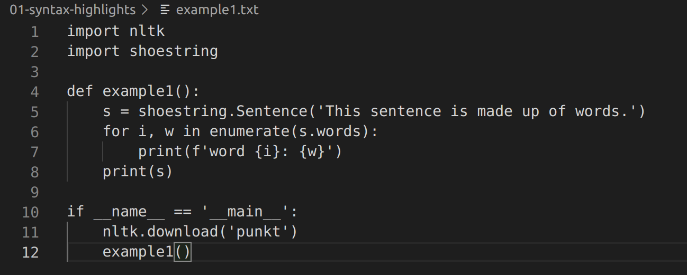
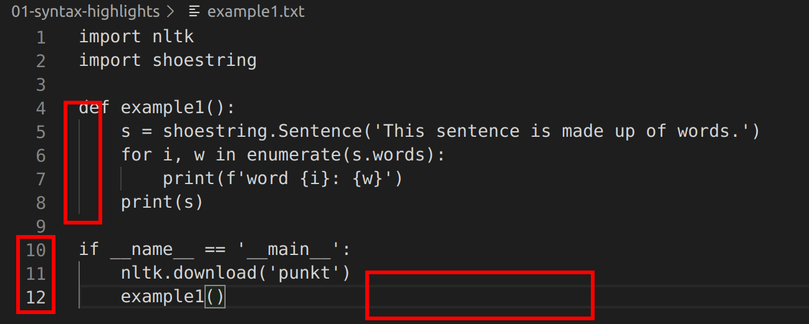
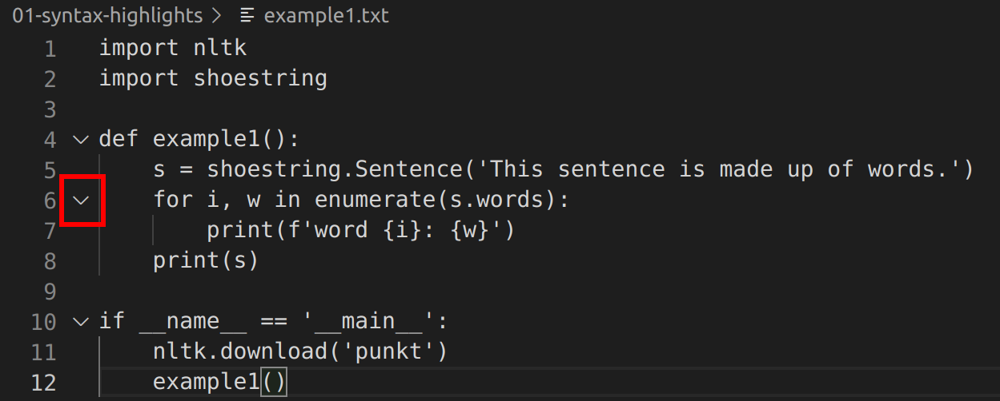
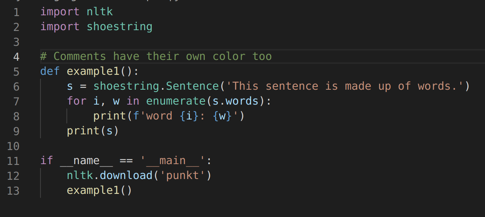

# Basic UI & Syntax highlights

## What is an IDE?

An [IDE](https://en.wikipedia.org/wiki/Integrated_development_environment)
is an *Integrated Development Environment*. The "integrated" is a big hint:
IDEs combine tools that *edit* code (a text editor) in the same package with
tools that *process* code (like an interpreter or compiler). Modern IDEs even
integrated [debugging](https://code.visualstudio.com/docs/editor/debugging),
[version control](https://code.visualstudio.com/docs/editor/github),
[deployment](https://code.visualstudio.com/nodejs-deployment),
and [terminal access](https://code.visualstudio.com/docs/editor/integrated-terminal).

When the tool you use to write code can also understand the code, it can support
you in ways that make your life much, much easier.

## UI Overview

IDEs like VSCode offer a lot of different functions. Here's a guide to their names:

(The "status bar" refers to the blue bar at the bottom of the window.)

For much more detail, see the
[official VSCode UI documentation](https://code.visualstudio.com/docs/getstarted/userinterface).

## Text editing

[This file with a .txt extension](./assets/without_syntax_highlighting.txt) actually contains
Python code. We've changed the extension to show basic text editing. Here's what you get:

Already there's a lot of nice features to help with focus:

* **Vertical bars** let you visualize different indent levels
* **Line numbers** help you stay organized
* **Horizontal highlights** draw focus to the line where the cursor is

You can even hide sections of text you aren't working on by collapsing an
indent level using the arrows:

If you click the highlighted caret, this becomes:

But the IDE will really shine when you use language-specific features.

## Syntax highlights

If you have an appropriate [extension](https://code.visualstudio.com/api/language-extensions/overview)
installed for the language you're working with, VSCode can provide
language-specific features based on the file's extension. For instance,
[this is a Python file](./assets/with_syntax_highlighting.py).

When we open it, we get **syntax highlights**:

the colors and styling
show you how the interpreter or compiler will understand each word.

Features vary based on the language. For instance, with a
[markdown file](./assets/markdown-example.md),
highlights in the editor pane hint at the finished result.
VSCode will also preview the actual rendered Markdown in another pane, too:

Later on, we'll discuss even more
[static program analysis](https://en.wikipedia.org/wiki/Static_program_analysis)
features that provide advanced refactoring functionality. Remember, the IDE
*understands* your code as you write it, so it lets you edit intelligently.

One way it can help is by highlighting problems in real time.
