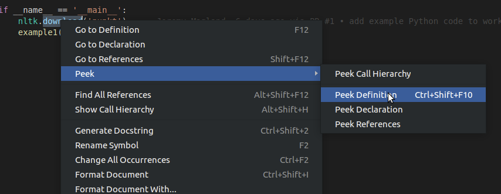
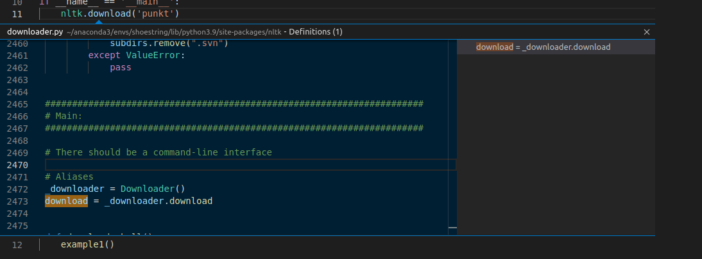
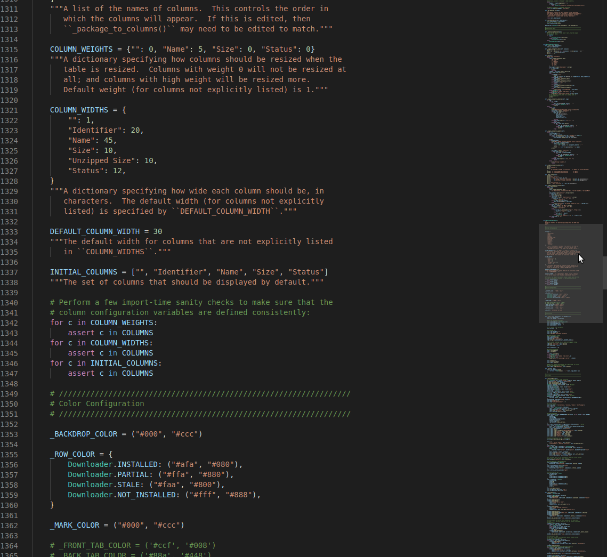
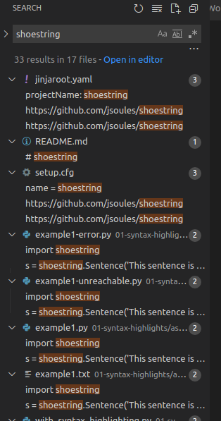
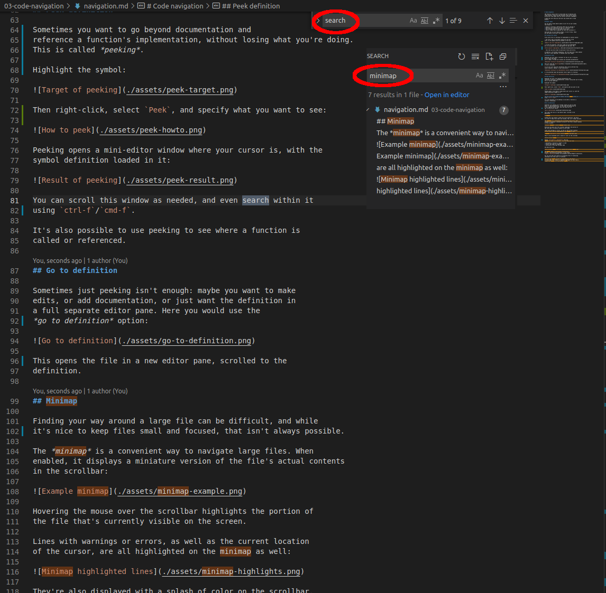

# Code navigation

IDE features really start to shine when you're dealing with
large projects. These can span multiple files across several
directories (and might even use several different languages).

A good tool will help you find your way around even a large
project.

## Editor panes

You can open as many editor panes as will fit on your window.
This helps to:

* Look at a function's definition while you're calling it
* Reference how something was done in a different file
* Edit multiple parts of the same file at once
* Look at sample data alongside the code that processes it

Each pane has its own *editor group*, or set of files. These
are the tabs at the top of the pane.

## Tracking file status

Files with errors or warnings are highlighted in several places:

* The file's tab in the editor group will be set to the
color of the highest-severity problem in the file:

* In the file explorer, the file's name will be highlighted.
All of its parents will be highlighted the same way, too:

  this lets you drill down to particular files with errors.

In addition, with GitHub integration, the file name color shows whether
the file is new, modified, or deleted since last commit.

## Mouseover hints

Sometimes you just need a refresher for how to call a function.
If you hover the mouse
over a symbol, VS Code will display any available documentation:

This will show the [docstring](https://realpython.com/documenting-python-code/),
if one is available.

It can also just show the information that can be inferred from
static analysis, whether a class constructor:

or the permitted input and possible return types of a function:

## Peek definition

Sometimes you want to go beyond documentation and
reference a function's implementation, without losing what you're doing.
This is called *peeking*.

Highlight the symbol:

Then right-click, select `Peek`, and specify what you want to see:

Peeking opens a mini-editor window where your cursor is, with the
symbol definition loaded in it:

You can scroll this window as needed, and even search within it
using `ctrl-f`/`cmd-f`.

It's also possible to use peeking to see where a function is
called or referenced.

## Go to definition

Sometimes just peeking isn't enough: maybe you want to make
edits, or add documentation, or just want the definition in
a full separate editor pane. Here you would use the
*go to definition* option:

This opens the file in a new editor pane, scrolled to the
definition.

## Minimap

Finding your way around a large file can be difficult, and while
it's nice to keep files small and focused, that isn't always possible.

The *minimap* is a convenient way to navigate large files. When
enabled, it displays a miniature version of the file's actual contents
in the scrollbar:

Hovering the mouse over the scrollbar highlights the portion of
the file that's currently visible on the screen.

Lines with warnings or errors, as well as the current location
of the cursor, are all highlighted on the minimap as well:

They're also displayed with a splash of color on the scrollbar.

## Full project search

Typing `ctrl-shift-f`/`cmd-shift-f` lets you
search all files in the project. This can help you find:

* Everywhere a function or import is used
* Places code might be repeated
* Variations of the same variable name

and many more uses.

The search supports restricting to whole-word
matches, case-sensitive matching, or even using
[regular expressions](https://en.wikipedia.org/wiki/Regular_expression).

You can also edit the results by collapsing files or dismissing
individual hits that aren't of interest.

Hits for your search string are highlighted in the editor
in every open file. There's highlights for both hits from a
single-file search or a full-project search:

