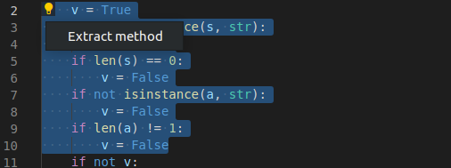
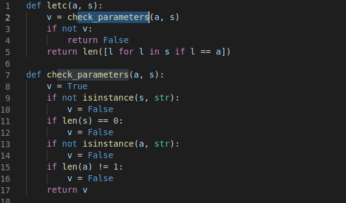
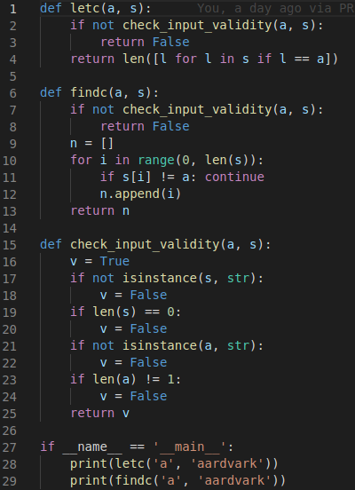
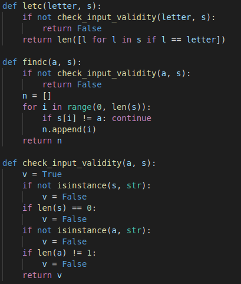
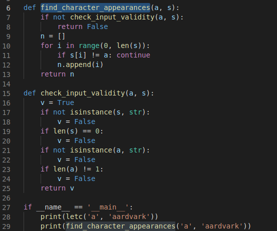
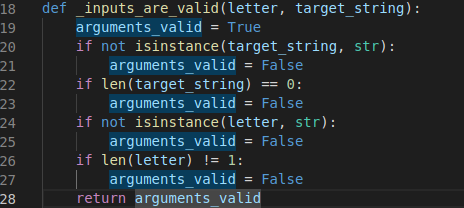
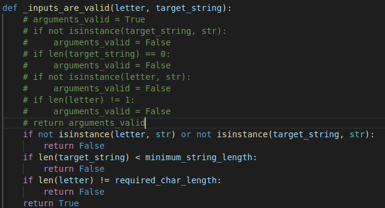

# Refactoring tools

The IDE is aware of basic programming concepts, like
[scope](https://en.wikipedia.org/wiki/Scope_(computer_science)). This
allows it to offer context-aware
[tools to help refactor](https://code.visualstudio.com/docs/editor/refactoring) your code--so
you can confidently [make significant edits](https://en.wikipedia.org/wiki/Code_refactoring)
without changing how the code works (unless you mean to).

Consider [this file defining two functions related to strings](./assets/example3.py).
While these functions are not individually long or complex,
they aren't commented or explained at all, and the terse names for the functions
and variables are the opposite of
[self-documenting](https://en.wikipedia.org/wiki/Self-documenting_code).
There are also some less-than-ideal design choices--like functions that
might return a useful value or might return `False`--but let's assume
that we don't want to change the actual behavior, only
improve the implementation.

How can an IDE help accomplish this?

## Extract a function

The file defines two functions, `letc()` and `findc()`.
They both start with the same code, which
looks like it's doing parameter validation: it confirms the
parameters `a` and `s` are strings, and that `a` is one character
and `s` is not empty. The functions return `False` if any of those
conditions aren't met.

Rather than reimplement these checks many times, let's make a separate
function with a clear name that can be called by both `letc()` and `findc()`.

To do this, we highlight lines 2 through 10, and note the little light bulb
pop-up. Click this and select `Extract method`:

This creates a new function with a name we choose, and replaces the highlighted
text with a call to that function:

After updating `findc()` so that it also calls `check_parameters()`,
we get something like [this revised example](./assets/example3b-extract.py):

## Scope-aware renaming

From running the script, it seems that `letc()` counts the number of times
a letter appears in a string, and `findc()` gives the indexes where it appears.
The parameter `a` is the character being searched for and `s` is the string to search in.
Renaming everything will make this a lot clearer. But we don't want to change
every occurrence of `a` or `s`--like the letter 'a' when it's being used as
a parameter in the `__main__` section!

Fortunately, the IDE is aware of the meaning of every symbol, and can rename them
intelligently.

### Variables

Renaming a variable affects only the uses where it is in scope. Start from here:

Highlight `a`, right-click and choose "Rename symbol," and use 'letter' as the new
name. The name is changed, only within this function:

Note that the name is not changed where it isn't in scope.

(Of course, if you *do* want to change every occurrence, conventional find-replace
functionality is still available with `ctrl-h` or `cmd-h`.)

### Functions

Function names are also symbols, so the same process works for those:

(Another nice text editor feature: VS Code helps you find matching symbols
and repeated code by highlighting every occurrence of the selected text.)

After renaming:

Doing this a few more times will yield
[code that is much clearer](./assets/example3c-rename.py).

## Comment/uncomment section

It can also be convenient, in rewriting or in testing, to comment
out large sections of code. Fortunately there's a keyboard shortcut
for this! Suppose we'd like to edit the new `_inputs_are_valid()`
function to be a little less repetitive, but we don't want to delete
the original contents until we're done replacing them. Start like this:

Highlight the lines to comment (any part of the line will do) and
type `ctrl-k` then `ctrl-c` to comment those lines out in a
language-appropriate way:

To uncomment lines, use `ctrl-k ctrl-u`.

This can also be toggled with `ctrl-/` or with the "Toggle line comment"
option from the edit menu. If the language supports block comments,
these are also available from the edit menu or with `ctrl-shift-a`.

## Multi-line editing

One more convenience feature is the ability to type on multiple lines
at once. This is very convenient for aligning equals signs in long lists
of variables, renaming several variables at once, or working with text
tables.

Hold `ctrl-shift` and type the up arrow or down arrow to add a cursor to
the line above or below the current one:

Now typing text once will put it on both lines:

To revert to standard cursor, hit the `Esc` (escape) key.
